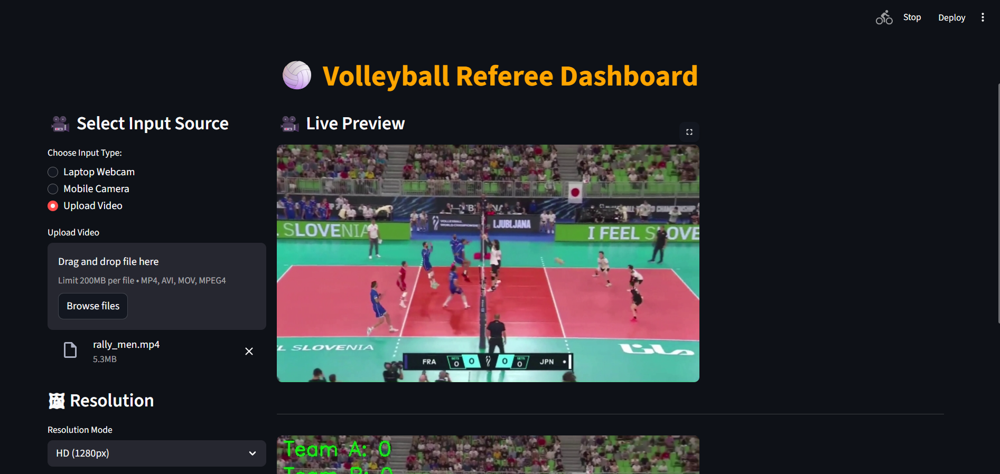

# 🏐 Smart Volleyball Referee System  
### **AI-Powered Officiating & Game Enhancement Using Computer Vision**  
**Author: Abhinav N Devadiga**

---

## 🎬 Dashboard Overview

<div align="center">
  <table>
    <tr>
      <td style="border:2px solid #444; border-radius:8px; padding:8px;">
        
        <p align="center"><b>Live Dashboard – Detection & Scoring View</b></p>
      </td>
      <td style="border:2px solid #444; border-radius:8px; padding:8px;">
        
        <p align="center"><b>Dashboard Controls & Camera Inputs</b></p>
      </td>
    </tr>
  </table>
</div>

---

## 🎥 AI Detection Output Demonstrations

### 🟡 Ball Detection

<div align="center">
  <table>
    <tr>
      <td style="border:2px solid #444; border-radius:8px; padding:8px;">
        
        <p align="center"><b>Real-Time Volleyball Detection</b></p>
      </td>
      <td style="border:2px solid #444; border-radius:8px; padding:8px;">
        
        <p align="center"><b>YOLO-Based Ball Tracking Accuracy</b></p>
      </td>
    </tr>
  </table>
</div>

---

### 🟢 Court & Player Detection

<div align="center">
  <table>
    <tr>
      <td style="border:2px solid #444; border-radius:8px; padding:8px;">
        
        <p align="center"><b>Court Boundary Detection</b></p>
      </td>
      <td style="border:2px solid #444; border-radius:8px; padding:8px;">
        
        <p align="center"><b>Multi-Player Detection & Tracking</b></p>
      </td>
    </tr>
  </table>
</div>

---

### 🔵 Action Recognition

<div align="center">
  <table>
    <tr>
      <td style="border:2px solid #444; border-radius:8px; padding:8px;">
        
        <p align="center"><b>Action Detection (Spike / Block / Serve)</b></p>
      </td>
    </tr>
  </table>
</div>

---

## 🧠 Project Description

The **Smart Volleyball Referee System** is a **real-time AI officiating platform** built using  
**Ultralytics YOLO, OpenCV, PyTorch, and Streamlit**.

It assists referees and analysts by **automatically detecting gameplay events**, improving accuracy, fairness, and match analysis.

### 🎯 Core Capabilities
- 🟡 Volleyball detection  
- 🔵 Player action recognition (spike, block, serve, receive, set)  
- 🟢 Court boundary detection  
- 🎯 IN / OUT decision logic  
- 🏆 Automatic point assignment  
- ⚡ GPU-accelerated real-time inference  

---

## 🖥 Input Sources Supported

- 💻 Laptop webcam  
- 📱 Mobile camera (IP Webcam / DroidCam)  
- 📂 Uploaded match videos  

All processed inside a **clean, real-time dashboard interface**.

---

## 🚀 Features

### 🔍 AI Features
- Ball detection  
- Player detection  
- Action classification  
- Court detection  
- IN / OUT decision system  
- Auto scoring logic  
- HD / SD inference modes  

### 🖥 Dashboard Features
- Webcam & mobile camera input  
- Video upload support  
- FPS & latency monitoring  
- Live connection status  
- Two-column responsive layout  
- Clean UI optimized for live matches  

---

## 🧰 Tech Stack

- **Python**
- **Streamlit**
- **OpenCV**
- **Ultralytics YOLOv8 / YOLO11**
- **PyTorch (CUDA 12.x)**
- **Requests**

### 💻 Recommended Hardware
- NVIDIA RTX 3050 or higher  
- Any CUDA-enabled GPU  

---

## ▶️ How to Run

### 🔹 Using Python Virtual Environment
```bash
C:\projects\VOLLEYBAL> venv\Scripts\activate
streamlit run dashboard.py
🔹 Using Batch File
Run_Dashboard.bat

📄 License

This project is licensed under the MIT License.
You are free to use, modify, distribute, and commercialize this project with proper attribution.

👤 Author

Abhinav N Devadiga
AI & Computer Vision Developer
Smart Sports Analytics & Officiating Systems


---

## ✅ FINAL STEP (Push to GitHub)

```bash
git add README.md
git commit -m "Professional dark-mode README with organized visuals"
git push origin main
